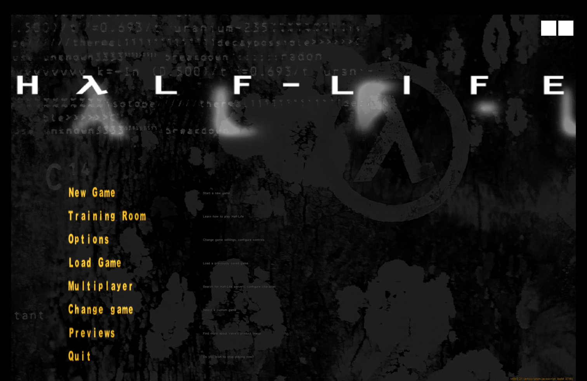
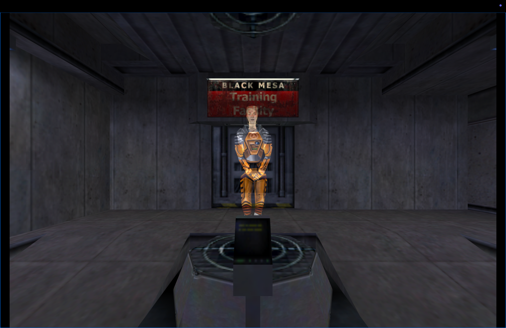
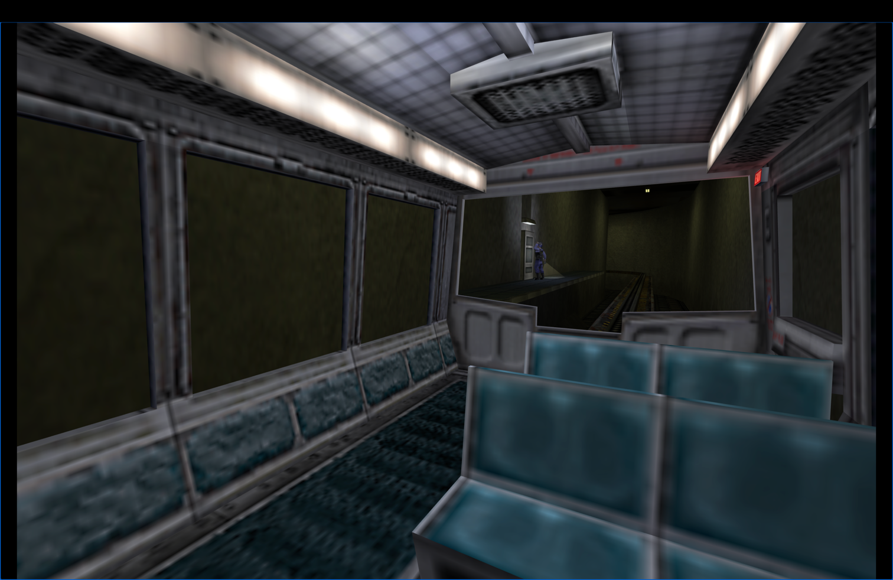
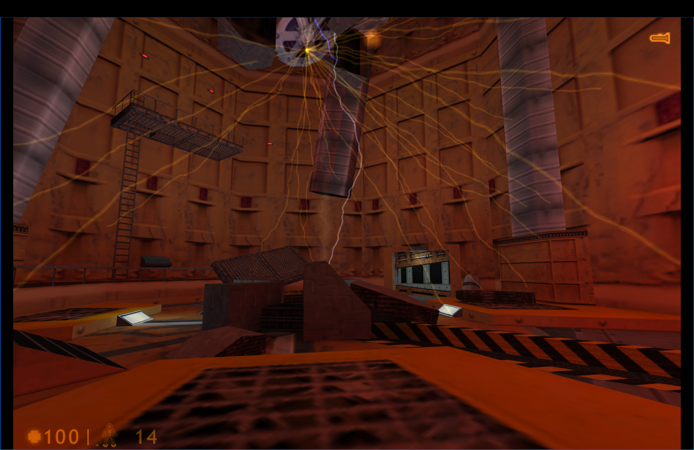
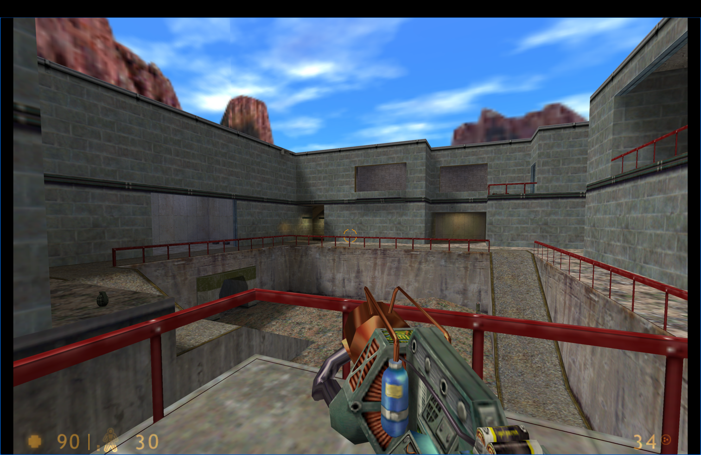
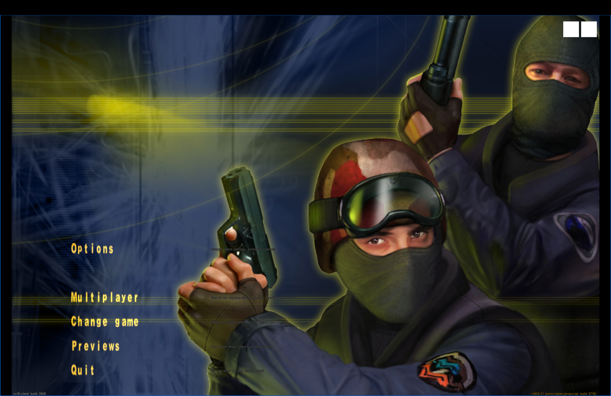
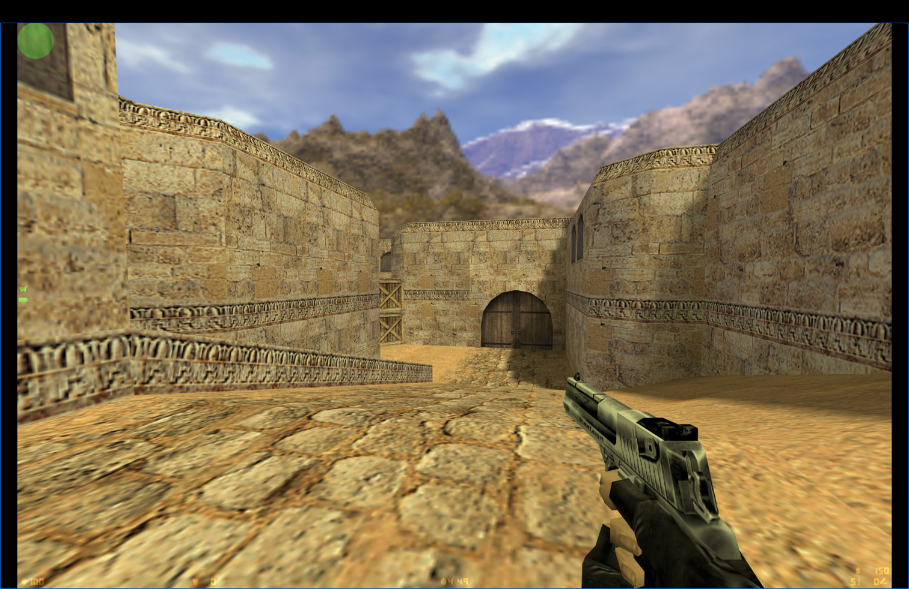
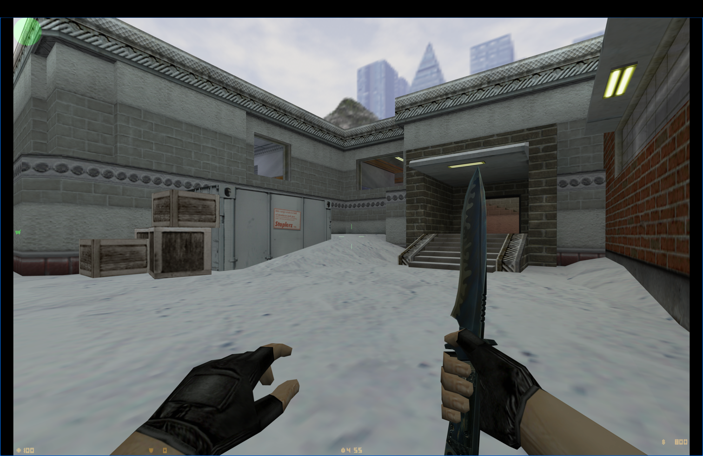
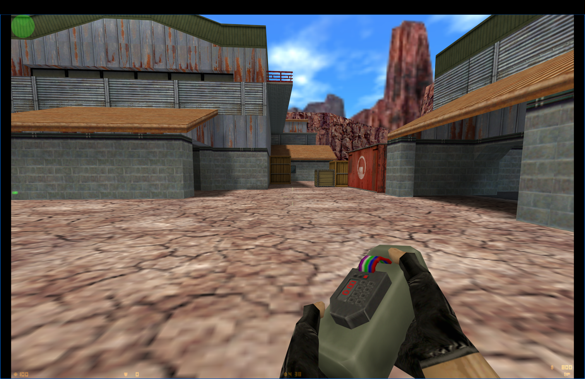

# Xash3D-FWGS Emscripten Web Port

This project is an [Emscripten](https://emscripten.org/)-based web port of [Xash3D-FWGS](https://github.com/FWGS/xash3d-fwgs), an open-source engine for games based on the GoldSource engine.

# Compiling and running 

## Clone the repository

```bash
git clone --recurse-submodules https://github.com/yohimik/webxash3d-fwgs.git
cd webxash3d-fwgs
```

## Game Content

You must provide your own game files (e.g., from Steam):
```shell
steamcmd +force_install_dir ./hl +login your_steam_username +app_update 70 validate +quit
```

Zip and and copy the `valve` folder from your Half-Life installation into the `public/valve.zip`.
Note: zip contents should be like this:
```shell
/valve.zip
├──┬/valve                  
│  ├───/file1           
│  └───/file2...  
└──┬/cstrike                  
   ├───/file1           
   └───/file2...  
```


## Compile and run

### hlsdk

```shell
docker compose -f hlsdk.docker-compose.yml up -d
```

Navigate in your browser to `http://localhost:8080`

<details>
  <summary>Screenshots (black frames - mac book camera, blue frames - browser active outline)</summary>







</details>

### cs16-client

```shell
docker compose -f cs16-client.docker-compose.yml up -d
```

Navigate in your browser to `http://localhost:8081`

<details>
  <summary>Screenshots (black frames - mac book camera, blue frames - browser active outline)</summary>






</details>

# TODO

## RAM optimization

Reduce current stack size to min.

## NPM

Fix all issues above and publish `xash3d-fwgs` npm package.

## WebGL improves (potentially)

Support GLES3Compat batching and fix `Vertex buffer is not big enough for the draw call.Understand this warning` warning.

## Scripts (potentially)

Some scripts stop working after saving and loading (eg. the guard doesn't open the train door).
